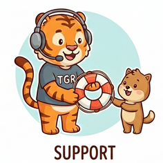
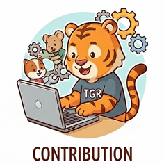

# tgr

[:heart: Sponsor](https://github.com/sponsors/jjournet)

## Disclaimer

This software is still in its early/alpha stage, changes can happen, and everything is not ironed out yet.

## Overview

`tgr` is a powerful terminal user interface (TUI) for GitHub, designed to streamline your workflow without leaving the command line.

**Key Functionalities:**
- **Repository Navigation**: Quickly browse and switch between your GitHub repositories.
- **Issue Management**: View and filter issues to stay on top of your tasks.
- **Workflow Actions**:
  - List workflow runs.
  - Trigger workflows with custom inputs.
  - **Watch Mode**: Monitor workflow execution logs in real-time, similar to `gh run watch`.

## Support

We value your feedback and want to help you succeed with `tgr`.

- **Bugs**: If you find a bug, please open an [Issue](https://github.com/jjournet/tgr/issues) with details to help us reproduce it.
- **Discussions**: For feature requests, ideas, questions, or general feedback, please use the [Discussions](https://github.com/jjournet/tgr/discussions) tab.

## Contribution

We welcome contributions from the community! To contribute to `tgr`:

1.  **Fork** the repository.
2.  Create a new **Branch** for your feature or fix (`git checkout -b feature/amazing-feature`).
3.  **Commit** your changes (`git commit -m 'Add some amazing feature'`).
4.  **Push** to the branch (`git push origin feature/amazing-feature`).
5.  Open a **Pull Request**.

Please ensure your code adheres to the project's coding standards and includes appropriate tests.

## Sponsor

If you like this project, please consider sponsoring it: [https://github.com/sponsors/jjournet](https://github.com/sponsors/jjournet)

## Special thanks

Thank you to [Fernand Galiana](https://github.com/derailed), creator of [k9s](https://github.com/derailed/k9s), the TUI for Kubernetes. I used it daily, and it gave me the idea for `tgr`.

Thank you also to all the open-source community for providing so many amazing librairies and tools.

